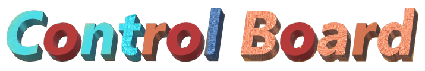
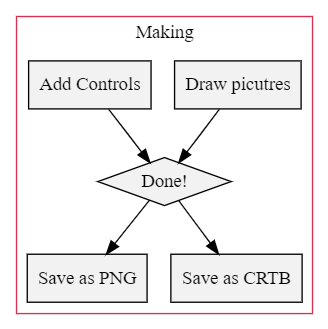
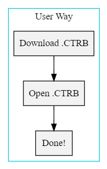
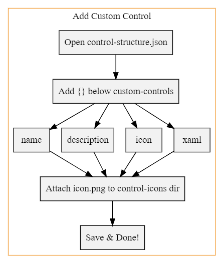

===
**Control Board** is not common drawing tools such as a program conducts only drawing.  
**Control Board** let you to make a ***interactive board*** for *lecture* & reports or ***educations***

# Why Control Board?
If you're **professor** or need to **teach** someone or send *clear & simple* report, then you'll need it.  
In the **live broadcast**, It's *perfect*.  
**Because** It is the ***Easiest*** and ***Convenient*** for usual situations.

# What can I do with Control Board?
* ***Record to video*** What you drawing.
* Add Interactive Controls so ***More Intuitive***
* ***Customize*** Control Board with coding directly or some toolkits.

# How can I use?
## Situation #1 - Make .CTRB file
  
===

## Situation #2 - Download .CTRB file

===

# How can I use? - ***Advanced***
## Situation #3 - Make custom control

===